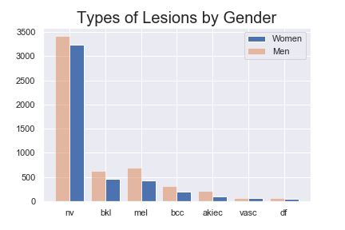
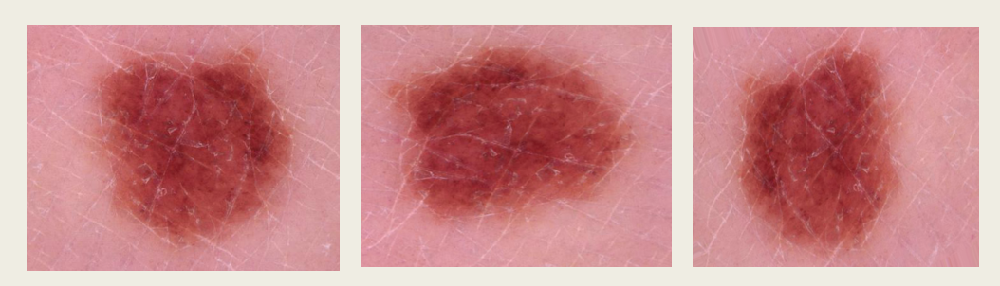
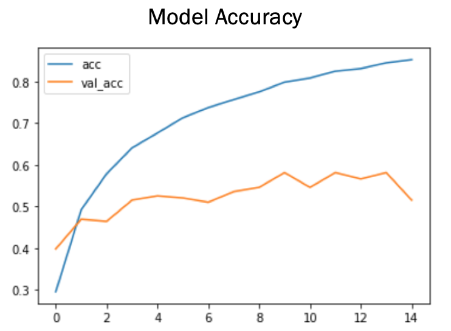

# Skin Lesion Identification with Data Augmentation and Convolutional Neural Networks

## Problem Statement

According to the Skin Cancer Foundation, skin cancer is the most common cancer in the world. So common that one in five people in the United States will develop it by the time they are 70. In more serious cases, like melanoma, patients treated over 30 days after being biopsied have anywhere from 5%-41% higher risk of death compared with those treated in under 30 days. These statistics make it clear that detection and action is crucial, but often that time can be slowed down by diagnosis and human error. The goal of this study is to reduce the human error involved in diagnosis for biopsy by accurately classifying a skin lesion into one of seven categories using a convolutional neural network. The baseline is approximately 14% accuracy and best results will be defined by an accuracy score above 50%. 

## Data Dictionary

Data too large to load to GitHub and can be found here: https://www.kaggle.com/kmader/skin-cancer-mnist-ham10000

|Folder|Source|Contents|
|---|---|---|
|HAM10000_images_part_1|Kaggle/ISIC|contains the first set of the 10,015 images|
|HAM10000_images_part_2|Kaggle/ISIC|contains the second set of the 10,015 images|
|image_data|validation|HAM10000 Images|contains 25% of the HAM10000 images for validation; code in notebook|
|image_data_train|HAM10000 Images|contains 50% of the HAM10000 images for training; code in notebook|
|image_data_test|HAM10000 Images|contains 25% of the HAM 10000 images for testing; code in notebook|
|image_data_train_augmented|image_data_train|dataset of 26,000+ images created from augmenting the image_data_train; code in notebook|
|image_data_test_balanced|image_data_test|dataset of 196 images created from balancing the image_data_test; code in notebook|
|image_data_validation_balanced|image_data_validation|dataset of 196 images created from balancing the image_data_validation; code in notebook|
|HAM10000_metadata.csv|Kaggle/ISIC|decriptive data pertaining to each image|
|pre_processed_data_from_isic|Kaggle/ISIC|single array data of the pixels in the images|

## Libraries
- Keras/Tensorflow
- PIL/Pillow
- Pandas
- Matplotlib
- os

## Repository Structure
- cnn_models:
    - older_models: models with lower performance
    - final_model
    - model_performances: breakdown of all of the models that were considered and their performance
- data_imports_analysis_and_augmentation_code
    - 1_data_import_and_exploration
    - 2_target_folder_creation
    - 3_playing_with_images
    - 4_manually_augmenting_data_code
    - 5_meta_data_model
- images
- note: saved model weights could not be uploaded due to file size

## Executive Summary

The data for this study was collected from MNIST HAM10000 Image dataset on Kaggle. This dataset contains 10,015 images of skin lesions that have been separated into seven categories (Actinic keratoses and intraepithelial carcinoma / Bowen's disease (akiec), basal cell carcinoma (bcc), benign keratosis-like lesions (solar lentigines / seborrheic keratoses and lichen-planus like keratoses) (bkl), dermatofibroma (df), melanoma (mel), melanocytic nevi (nv) and vascular lesions (angiomas, angiokeratomas, pyogenic granulomas and hemorrhage) (vasc) by histopathology, evaluation or expert consensus. The images were downloaded and separated into train(50%), validation(25%) and test(25%) sets using the code in the "2_target_folder_creation" notebook. They were also assigned a label that is listed below:

- akiec : 0
- bcc : 1
- bkl : 2
- df : 3
- mel : 6
- nv : 4
- vasc : 5

As seen in the picture below, while the sampling from each gender is balanced, the category counts are highly imbalanced with melanocytic nevi(nv) making up 66% of the data and the class with the fewest number of samples, dermatofibroma (df), making up only a little over 1% of the data. 

In order to balance the classes, a function was used to augment the data using the Keras ImageGenerator. The function loops through the original pictures within a class folder, passes each through a random transformation and then re-saves it as a new image. It repeats this process until the class has equal to or greater than the number of images in the master class. This process increased the training data from 5,007 to 26,273 images and can be found in the "3_manually_augmenting_data_code" notebook. The images below are example of types of transformations performed on the original images to augment the data. 

The original pictures were 450 x 600 x 3, but due to computational power and memory, the input shape for the net had to be much smaller. Two approaches were taken to finding a model that could produce the best results. The first approach was a "home-grown" convolutional neural network trained on just the 26,273 augmented training images. This is referred to as "home-grown" because it did not use a pretrained model, and 26,273 images is a relatively small training batch for a CNN.The second approach was to use a pretrained model, specifically MobileNetV2, to try to accurately classify the data. The benefits to using this model is that it was trained on over of 14 million images to identify edges and shapes; the top layers can be removed in order to add on new fully connected layers that will specifically train to the dataset in this study. 

## Findings/Conclusions

The model that returned the best accuracy was a pretrained model with MobileNetV2 convolutional layers and six additional fully connected layers. The batch size was 256 and it returned an training accuracy score of 85% and a testing accuracy score of 58%. The training also included class weights to give more attention to class 6 - the melanomas - and class 2 - melanocytic nevi - with the intention of increaseing the recall for those specific classes. As seen in the pictures below, there model began to overfit despite the dropout and early stopping. 

The precision, recall and F1-score are listed below for each class.

|Class|Label|Precision|Recall|F1-Score|
|---|---|---|---|---|
|0|akiec|0.70|0.50|0.58| 
|1|bcc|0.68|0.61|0.64|
|2|bkl|0.37|0.68|0.48|
|3|df|0.86|0.21|0.34|
|4|nv|0.50|0.75|0.60|
|5|vasc|1.00|0.79|0.88|
|6|mel|0.52|0.54|0.53|

The model had a difficult time predicting classes 0, 3 and 6 in general, over-predicting for incorrect classes, but often missing when it actually was one of the three classes. Classes 4 and 5 were more easily identified and separated from the others. Batch size and data augmentation played a large role in the improved accuracy of the model, as well as increased image size. 

There is signal in the data. With more time and computational power, I feel confident that I could increase accuracy though maybe at the expense of longer testing time and more costly.

## Limitations/Future Studies

This is not yet to a standard where it could assist a dermatologist. It could be improved given more time and a better computer. In the future, I would like to run models with input size of 225 x 300 x 3 on AWS or a stronger system. I also think that more metadata- like the history of the patient, whether or not the lesion had changed in shape, how long the lesion had been there, etc. - might prove to be features that make a good model great. Additionally, once a better model can be created I would like to develop an application so that any person could run this test on their computer or phone with their own images.

## Resources
https://www.skincancer.org/skin-cancer-information/
https://www.kaggle.com/kmader/skin-cancer-mnist-ham10000
https://towardsdatascience.com/applied-deep-learning-part-4-convolutional-neural-networks-584bc134c1e2
https://www.degruyter.com/downloadpdf/j/itms.2017.20.issue-1/itms-2017-0003/itms-2017-0003.pdf
https://towardsdatascience.com/a-simple-cnn-multi-image-classifier-31c463324fa

